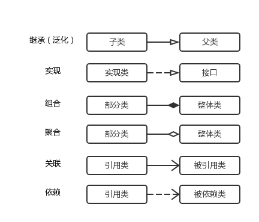

## Java基础

#### **1、Arrays.sort和Collections.sort实现原理解析**

首先区分Collection和Collections的区别：

- java.util.Collection 是一个**集合接口**。它提供了对集合对象进行基本操作的通用接口方法。
- java.util.Collections 是针对集合类的一个**帮助类**，他提供一系列静态方法实现对各种集合的搜索、排序、线程安全等操作。

源码追踪：

```java
		List<Integer> list = Arrays.asList(1,2,10,4,5,6);
        Collections.sort(list);
        for (Integer integer : list) {
            System.out.println(integer);
        }
```

```java
// Collections.java
public static <T extends Comparable<? super T>> void sort(List<T> list) {
	list.sort(null);
}
```

```java
	// List.java
	default void sort(Comparator<? super E> c) {
        Object[] a = this.toArray(); // 新建临时数组前去排序，然后再重新设置当前list
        Arrays.sort(a, (Comparator) c); // 由此可见与Arrays.sort调用的是同一方法
        ListIterator<E> i = this.listIterator();
        for (Object e : a) {
            i.next();
            i.set((E) e);
        }
    }
```

```java
	// Arrays.java
	public static <T> void sort(T[] a, Comparator<? super T> c) {
        if (c == null) {
            sort(a);
        } else {
            if (LegacyMergeSort.userRequested)
                legacyMergeSort(a, c);
            else
                TimSort.sort(a, 0, a.length, c, null, 0, 0);
        }
    }
```

```java
	// 由注释可以看出，该方法是旧的方法；
	/**
     * Old merge sort implementation can be selected (for
     * compatibility with broken comparators) using a system property.
     * Cannot be a static boolean in the enclosing class due to
     * circular dependencies. To be removed in a future release.
     */
    static final class LegacyMergeSort {
        private static final boolean userRequested =
            java.security.AccessController.doPrivileged(
                new sun.security.action.GetBooleanAction(
                    "java.util.Arrays.useLegacyMergeSort")).booleanValue();
    }
```

```java
	// TimSort.java
	static <T> void sort(T[] a, int lo, int hi, Comparator<? super T> c,
                         T[] work, int workBase, int workLen) {
        assert c != null && a != null && lo >= 0 && lo <= hi && hi <= a.length;

        int nRemaining  = hi - lo;
        if (nRemaining < 2)
            return;  // Arrays of size 0 and 1 are always sorted

        // If array is small, do a "mini-TimSort" with no merges
        if (nRemaining < MIN_MERGE) {
            int initRunLen = countRunAndMakeAscending(a, lo, hi, c);
            binarySort(a, lo, hi, lo + initRunLen, c);
            return;
        }

        /**
         * March over the array once, left to right, finding natural runs,
         * extending short natural runs to minRun elements, and merging runs
         * to maintain stack invariant.
         */
        TimSort<T> ts = new TimSort<>(a, c, work, workBase, workLen);
        int minRun = minRunLength(nRemaining);
        do {
            // Identify next run
            int runLen = countRunAndMakeAscending(a, lo, hi, c);

            // If run is short, extend to min(minRun, nRemaining)
            if (runLen < minRun) {
                int force = nRemaining <= minRun ? nRemaining : minRun;
                binarySort(a, lo, lo + force, lo + runLen, c);
                runLen = force;
            }

            // Push run onto pending-run stack, and maybe merge
            ts.pushRun(lo, runLen);
            ts.mergeCollapse();

            // Advance to find next run
            lo += runLen;
            nRemaining -= runLen;
        } while (nRemaining != 0);

        // Merge all remaining runs to complete sort
        assert lo == hi;
        ts.mergeForceCollapse();
        assert ts.stackSize == 1;
    }
```

Timsort的核心过程：
	Timsort算法为了减少对升序部分的回溯和对降序部分的性能倒退，将输入按升序和降序特点进行了分区。排序的单位不是一个个单独数字，而是一个个的块—分区。其中每一个分区叫一个run。针对这些run序列，每次拿一个run出来按规则进行合并。每次合并会将两个run合成一个。合并的结果保存到栈中。合并直到消耗掉所有的run，这时将栈上剩余的run合并到只剩一个run为止。这时这个仅剩的run便是排好序的结果。（有点类似于高考排名，先以各区县为单位排名，在合并到省市排名，再合并为全国的排名）

综上所述，Timsort算法的主要过程包括：

1. 如果数组长度小于某个值，直接用二分插入排序算法。
2. 找到各个run，并入栈。
3. 按规则合并run。


*TODO: TimSort.sort()未仔细查看*

参考《https://blog.csdn.net/gaobai_Siri/article/details/104441976》

#### 2、foreach和while的区别（编译之后）

- foreach加强for循环，已知循环次数，逐条读取，一般用于对象集合。 

- while循环不确定循环次数，逐行读取。只要满足条件就一直循环下去。

#### 外部类、静态内部类、局部内部类、成员内部类、匿名内部类

在Java中，可以将一个类定义在另一个类里面或者一个方法里边，这样的类称为内部类，广泛意义上的内部类一般包括四种：成员内部类，局部内部类，匿名内部类，静态内部类 。

1.成员内部类

​	（1）该类像是外部类的一个成员，可以无条件的访问外部类的所有成员属性和成员方法（包括private成员和静态成员）；

​	（2）成员内部类拥有与外部类同名的成员变量时，会发生隐藏现象，即默认情况下访问的是成员内部类中的成员。如果要访问外部类中的成员，需要以下形式访问：【外部类.this.成员变量  或  外部类.this.成员方法】；

​	（3）在外部类中如果要访问成员内部类的成员，必须先创建一个成员内部类的对象，再通过指向这个对象的引用来访问；

​	（4）成员内部类是依附外部类而存在的，也就是说，如果要创建成员内部类的对象，前提是必须存在一个外部类的对象；

​	（5）内部类可以拥有private访问权限、protected访问权限、public访问权限及包访问权限。如果成员内部类用private修饰，则只能在外部类的内部访问；如果用public修饰，则任何地方都能访问；如果用protected修饰，则只能在同一个包下或者继承外部类的情况下访问；如果是默认访问权限，则只能在同一个包下访问。外部类只能被public和包访问两种权限修饰。

2.局部内部类

​	（1）局部内部类是定义在一个方法或者一个作用域里面的类，它和成员内部类的区别在于局部内部类的访问仅限于方法内或者该作用域内；

​	（2）局部内部类就像是方法里面的一个局部变量一样，是不能有public、protected、private以及static修饰符的。

3.匿名内部类

​	（1）一般使用匿名内部类的方法来编写事件监听代码；

​	（2）匿名内部类是不能有访问修饰符和static修饰符的；

​	（3）匿名内部类是唯一一种没有构造器的类；

​	（4）匿名内部类用于继承其他类或是实现接口，并不需要增加额外的方法，只是对继承方法的实现或是重写。

4.内部静态类

​	（1）静态内部类是不需要依赖于外部类的，这点和类的静态成员属性有点类似；

​	（2）不能使用外部类的非static成员变量或者方法。


#### **Java线程为什么没有RUNNING状态？**

首先需要清楚java线程有哪些状态：

- NEW
- BLOCKED
- RUNNABLE
- TERMINATED
- TIME_WAITING
- WAITING

状态转换图如下：


理解WAITING和BLOCKED的区别：WAITING是已经分配了cpu时间片，但因需要等待其他时间，主动释放cpu资源，等待其他线程来唤醒；BLOCKED是尚未分配到时间片，因与其他线程竞争资源，被阻塞了，JVM知道如何唤醒该状态的线程，无需其他自定义线程的参与。

*TODO：待完善*


#### Java序列化

序列化的定义：是指将java对象转换成字节序列的过程；

反序列化：是指将字节序列恢复为Java对象的过程；

核心即对象状态的保存与重建；远程过程调用的重要内容；实现方法，继承Serializable接口；

重点：

- java对象序列化不仅保留了一个对象的数据，而且递归保存对象引用的每个对象的数据；
- 序列化可以实现内存中对象的传递、保存；
- 使用 Serializable 序列化的方式实现深拷贝比较简单，但是需要注意定义 serialVersionUID 的值，并且static 和 transient 类型的变量不会被序列化；
- serialVersionUID，根据名字知道这是一个与对象的状态有关的变量，如果代码中没有定义这样的变量，那么在运行的时候会按照一定的方式自动生成，在反序列化的时候会对这个值进行判断，如果两个值不相等，会抛出 InvalidClassException 。由于计算默认的 serialVersionUID 对类的详细信息具有较高的敏感性，一般建议在序列化的时候主动提供这个参数。


也可以参考：https://blog.csdn.net/weixin_43520450/article/details/106987765?utm_medium=distribute.pc_feed_404.none-task-blog-BlogCommendFromMachineLearnPai2-1.nonecase&depth_1-utm_source=distribute.pc_feed_404.none-task-blog-BlogCommendFromMachineLearnPai2-1.nonecas


#### 创建线程的方式

1. 实现Runnable接口，重载run()方法，无返回值；

2. 继承Thread类，复写run()方法；不足之处：java是单继承，如果有多个父类，无法满足；

3. 实现Callable接口，通过FutureTask/Future来创建有返回值的Thread线程，可以获得异步执行的结果；通过Executor执行；注：FutureTask是类，Future是接口。

4. 使用Executors创建ExecutorService，入参Callable或Future；可以创建哪三种类型的线程池：

   ```java
   public static ExecutorService newSingleThreadExecutor() {
       return new FinalizableDelegatedExecutorService
           (new ThreadPoolExecutor(1, 1,
                                   0L, TimeUnit.MILLISECONDS,
                                   new LinkedBlockingQueue<Runnable>()));
   }
   
   public static ExecutorService newFixedThreadPool(int nThreads) {
       return new ThreadPoolExecutor(nThreads, nThreads,
                                     0L, TimeUnit.MILLISECONDS,
                                     new LinkedBlockingQueue<Runnable>());
   }
   
   public static ExecutorService newCachedThreadPool() {
           return new ThreadPoolExecutor(0, Integer.MAX_VALUE,
                                         60L, TimeUnit.SECONDS,
                                         new SynchronousQueue<Runnable>());
   }
   
   ```

引申问题：

【1】Callable和Runnable接口的区别：

- 两个接口需要实现的方法名不一样，Runnable需要实现的方法为run()，Callable需要实现的方法为call()。
- 实现的方法返回值不一样，Runnable任务执行后无返回值，Callable任务执行后可以得到异步计算的结果。
- 抛出异常不一样，Runnable不可以抛出异常，Callable可以抛出异常。

【2】阿里巴巴开发手册并发编程这块有一条：线程池不允许使用Executors去创建，而是通过ThreadPoolExecutor的方式，为什么？

首先，看下ThreadPoolExecutor的创建方法：

```java
public ThreadPoolExecutor(int corePoolSize,                //线程池核心线程数量
                          int maximumPoolSize,             //线程池最大数量
                          long keepAliveTime,              //空闲线程存活时间
                          TimeUnit unit,                   //时间单位
                          BlockingQueue<Runnable> workQueue,  //线程池所使用的缓冲队列
                          ThreadFactory threadFactory,        //线程池创建线程使用的工厂
                          RejectedExecutionHandler handler)   //线程池对拒绝任务的处理策略
```

Executors提供的很多方法默认使用的都是LinkedBlockingQueue,允许的请求队列长度为 Integer.MAX_VALUE，高负载情境下,无界队列很容易导致OOM,而OOM会导致所有请求都无法处理,这是致命问题。

【3】如何定义线程池参数？

**CPU密集型**：线程池的大小推荐为CPU数量+1，CPU数量可以根据Runtime.availableProcessors方法获取

**IO密集型**：CPU数量 * CPU利用率 *（1 + 线程等待时间/线程CPU时间）

混合型 => 将任务分为CPU密集型和IO密集型，然后分别使用不同的线程池去处理，从而使每个线程池可以根据各自的工作负载来调整

阻塞队列 => 推荐使用有界队列，有界队列有助于避免资源耗尽的情况发生

拒绝策略 => 默认采用的是AbortPolicy拒绝策略，直接在程序中抛出RejectedExecutionException异常【因为是运行时异常，不强制catch】，这种处理方式不够优雅。处理拒绝策略有以下几种比较推荐：

- 在程序中捕获RejectedExecutionException异常，在捕获异常中对任务进行处理。针对默认拒绝策略
- 使用CallerRunsPolicy拒绝策略，该策略会将任务交给调用execute的线程执行【一般为主线程】，此时主线程将在一段时间内不能提交任何任务，从而使工作线程处理正在执行的任务。此时提交的线程将被保存在TCP队列中，TCP队列满将会影响客户端，这是一种平缓的性能降低
- 自定义拒绝策略，只需要实现RejectedExecutionHandler接口即可
- 如果任务不是特别重要，使用DiscardPolicy和DiscardOldestPolicy拒绝策略将任务丢弃也是可以的

如果使用Executors的静态方法创建ThreadPoolExecutor对象，可以通过使用Semaphore对任务的执行进行限流也可以避免出现OOM异常。

参考：https://www.cnblogs.com/kyoner/p/12318057.html


#### synchronized同步方法和同步代码块的区别

- 同步方法默认使用this或者当前类做为锁。

- 同步代码块可以选择以什么来加锁，比同步方法更精确，我们可以选择只有会在同步发生同步问题的代码加锁，而并不是整个方法。

- 同步方法使用synchronized修饰，而同步代码块使用synchronized(this){}修饰。
- 当一个线程访问object的一个synchronized(this)同步代码块时，其他线程对object中所有其它synchronized(this)同步代码块的访问将被阻塞。

参考：https://www.cnblogs.com/shoshana-kong/p/10561573.html

**底层实现参考（待确认）：**

```java
package com.wun.juc;

public class Test8Lock {

    public synchronized void test() {
        System.out.println("Function hello world!");
    }

    public void test01() {
        synchronized(this) {
            System.out.println("Block hello world!");
        }
    }

    public static void main(String[] args) {
        Test8Lock test8Lock = new Test8Lock();
        test8Lock.test();
        test8Lock.test01();
    }
}
```


```java
public synchronized void test();
    descriptor: ()V
    flags: ACC_PUBLIC, ACC_SYNCHRONIZED      //同步方法
    Code:
      stack=2, locals=1, args_size=1
         0: getstatic     #2                  // Field java/lang/System.out:Ljava/io/PrintStream;
         3: ldc           #3                  // String Function hello world!
         5: invokevirtual #4                  // Method java/io/PrintStream.println:(Ljava/lang/String;)V
         8: return
      LineNumberTable:
        line 6: 0
        line 7: 8
      LocalVariableTable:
        Start  Length  Slot  Name   Signature
            0       9     0  this   Lcom/wun/juc/Test8Lock;
```

```java
public void test01();
    descriptor: ()V
    flags: ACC_PUBLIC
    Code:
      stack=2, locals=3, args_size=1
         0: aload_0
         1: dup
         2: astore_1
         3: monitorenter
         4: getstatic     #2                  // Field java/lang/System.out:Ljava/io/PrintStream;
         7: ldc           #5                  // String Block hello world!
         9: invokevirtual #4                  // Method java/io/PrintStream.println:(Ljava/lang/String;)V
        12: aload_1
        13: monitorexit                       //同步代码块
        14: goto          22
        17: astore_2
        18: aload_1
        19: monitorexit                       //同步代码块
        20: aload_2
        21: athrow
        22: return
      Exception table:
         from    to  target type
             4    14    17   any
            17    20    17   any
      LineNumberTable:
        line 10: 0
        line 11: 4
        line 12: 12
        line 13: 22
      LocalVariableTable:
        Start  Length  Slot  Name   Signature
            0      23     0  this   Lcom/wun/juc/Test8Lock;
      StackMapTable: number_of_entries = 2
        frame_type = 255 /* full_frame */
          offset_delta = 17
          locals = [ class com/wun/juc/Test8Lock, class java/lang/Object ]
          stack = [ class java/lang/Throwable ]
        frame_type = 250 /* chop */
          offset_delta = 4

```

#### Comparable和Comparator

- Comparable可以认为是一个内比较器，实现了Comparable接口的类有一个特点，就是这些类是可以和自己比较的，至于具体和另一个实现了Comparable接口的类如何比较，则依赖compareTo方法的实现。Comparable可以认为是一个内比较器；

- Comparator接口里面有一个compare方法，方法有两个参数T o1和T o2，是泛型的表示方式，分别表示待比较的两个对象；因为泛型指定死了，所以实现Comparator接口的实现类只能是两个相同的对象，Comparator可以认为是是一个外比较器

总结一下，两种比较器Comparable和Comparator，后者相比前者有如下优点：

1. 如果实现类没有实现Comparable接口，又想对两个类进行比较（或者实现类实现了Comparable接口，但是对compareTo方法内的比较算法不满意），那么可以实现Comparator接口，自定义一个比较器，写比较算
2. 实现Comparable接口的方式比实现Comparator接口的耦合性要强一些，如果要修改比较算法，则需要修改Comparable接口的实现类，而实现Comparator的类是在外部进行比较的，不需要对实现类有任何修改。从这个角度说，实现Comparable接口的方式其实有些不太好，尤其在我们将实现类的.class文件打成一个.jar文件提供给开发者使用的时候。实际上实现Comparator 接口的方式后面会写到就是一种典型的策略模式。


参考：https://blog.csdn.net/diweikang/article/details/80788194

#### 生产者-消费者模式代码实现

```java
// 实现方式一，忽略了try
public class Test1{
	private static LOCK = "lock";
	private static Integer count = 0;
	private static Integer FULL = 10;
	
	class Producer implements Runnable {
		public void run() {
			synchronized (LOCK) {
				while(count == FULL) {
					LOCK.wait();
				}
				count++;
				LOCK.notifyAll();
			}
		}
		
	}
	
	class Consumer implements Runnable {
		public void run() {
			synchronized (LOCK) {
				while(count == 0){
					LOCK.wait();
				}
				count--;
				LOCK.notifyAll();
			}
		}
	}
}
```

```java
// 实现方式二、
public class Test2{
	private static Integer count = 0;
	private static Integer FULL = 10;
	
	private static Lock lock = new ReentrantLock();
	private static Condition notEmpty = lock.newCondition();
	private static Condition notFull = lock.newCondition();
	class Producer implements Runnable {
		public void run() {
			lock.lock();
			try {
				while(count == FULL) {
					notFull.await();
				}
				count++;
				notEmpty.signal();
			} finally {
				lock.unlock();
			}
		}
	}
	class Consumer implements Runnable {
		public void run() {
			lock.lock();
			try {
				while(count == 0){
					notEmpty.await();
				}
				count--;
				notFull.signal();
			} finally {
				lock.unlock();
			}
		}
	}
}
```

```java
// 基于信号量的实现
public class Test4 {
	private static int count = 0;
	final Semaphore notEmpty = new Semaphore(0);
	final Semaphore notFull = new Semaphore(10);
	final Semaphore mutex = new Semaphore(1);
	
	class Producer implements Runnable {
		public void run() {
			try {
				notFull.acquire();
				mutex.acquire();
				count++;
			} catch(...) {
			} finally {
				mutex.release();
				notEmpty.release();
			}
		}
	}
	
	class Consumer implements Runnable {
		public void run() {
			try {
				notEmpty.acquire();
				mutex.acquire();
				count--;
			} catch(...) {
			} finally {
				mutex.release();
				notFull.release();
			}
		}
	}
}
```

```java
// 基于BlockingQueue实现
public class Test3 {
	private static int count = 0;
	private final BlockingQueue<Integer> blockQueue = new BlockingQueue<Integer>(10);

	class Producer implements Runnable {
		public void run() {
			blockQueue.put(1);
			count++;
		}
	}
	
	class Consumer implements Runnable {
		public void run() {
			blockQueue.take();
			count--;
		}
	}
}
```

参考：https://www.jianshu.com/p/66e8b5ab27f6

#### 单例模式手写

参考：https://github.com/CyC2018/CS-Notes

#### 自动拆装箱

1、int和int之间，用==比较，肯定为true；
2、int与Integer比较，Integer会自动拆箱，==和equals都肯定为true；
3、Integer与Integer比较的时候，由于直接赋值的话会进行自动的装箱，当值在[-128,127]中的时候，不会创建对象，而是直接从缓存中获取已经创建好的对象，用==也为true
4、Integer与new Integer，用==时肯定为false；
5、new Integer与new Integer比较时，用==肯定为false；
6、valueOf装箱，xxxValue拆箱
7、Byte、Short、Integer、Long这几个类的实现类似

#### 简述同步IO、异步IO、阻塞IO、非阻塞IO之间的联系与区别

需查看原文！

参考：https://www.cnblogs.com/felixzh/p/10345929.html

#### **Java线程间的通信方式**

1. 同步：使用Synchronized关键字；
2. volatile(保持可见性)；
3. Lock-Condition机制；
4. wait()/notify()机制：synchronized代码块中wait；
5. while轮询；
6. 管道机制；

本质上前四种，都是基于共享内存的方式；

参考：https://blog.csdn.net/wlddhj/article/details/83793709 -- 有代码实现；可手写代码体会；

#### **Java中的BlockingQueue**

- ArrayBlockingQueue：数组阻塞队列，规定大小，其构造函数必须带一个int参数来指明其大小。其所含的对象是以FIFO（先入先出）顺序排序的。
- LinkedBlockingQueue：链阻塞队列，大小不定，若其构造函数带一个规定大小的参数，生成的BlockingQueue有大小限制，若不带大小参数，所生成的BlockingQueue的大小由Integer.MAX_VALUE来决定。其所含的对象是以FIFO顺序排序的。
- PriorityBlockingQueue：类似于LinkedBlockingQueue,但其所含对象的排序不是FIFO，而是依据对象的自然排序顺序或者是构造函数所带的Comparator决定的顺序。无解阻塞队列。
- SynchronousQueue：特殊的BlockingQueue，它的内部同时只能够容纳单个元素，对其的操作必须是放和取交替完成的。
- DelayQueue：延迟队列，注入其中的元素必须实现 java.util.concurrent.Delayed 接口；使用优先级队列实现的无界阻塞队列；
- LinkedTransferQueue：一个链表结构组成的无界阻塞队列；
- LinkedBlockingDeque：一个由链表结构组成的双向阻塞队列；

BlockingQueue的实现原理：使用通知者模式，类似于生产者/消费者模式；

参考：https://www.cnblogs.com/bjxq-cs88/p/9759571.html

参考：《Java并发编程的艺术》 

#### Unsafe类的作用

**通常我们最好也不要使用Unsafe类，除非有明确的目的，并且也要对它有深入的了解才行。**Unsafe类使用了单例模式，需要通过一个静态方法getUnsafe()来获取。但Unsafe类做了限制，如果是普通的调用的话，它会抛出一个SecurityException异常；只有由主类加载器加载的类才能调用这个方法。

```java
public static Unsafe getUnsafe() {
    Class var0 = Reflection.getCallerClass();
    if(!VM.isSystemDomainLoader(var0.getClassLoader())) {
        throw new SecurityException("Unsafe");
    } else {
        return theUnsafe;
    }
}
```

- 内存管理
- 非常规的对象实例化
- 操作类、对象、变量
- 数组操作
- 多线程同步
- 挂起和恢复：许多并发类中用到了park、unpark方法；
- 内存屏障

参考：https://www.cnblogs.com/pkufork/p/java_unsafe.html

#### 线程池的实现原理


```java
public ThreadPoolExecutor(int corePoolSize,
            　　　　　　　　　　　int maximumPoolSize,
                              long keepAliveTime,
                              TimeUnit unit,
                              BlockingQueue<Runnable> workQueue,
                              ThreadFactory threadFactory,
                              RejectedExecutionHandler handler) {}
```

函数的参数含义如下：

- **corePoolSize**： 线程池核心线程数
- **maximumPoolSize**：线程池最大数
- **keepAliveTime**： 空闲线程存活时间
- **unit**： 时间单位
- **workQueue**： 线程池所使用的缓冲队列
- **threadFactory**：线程池创建线程使用的工厂
- **handler**： 线程池对拒绝任务的处理策略

参考：《Java并发编程的艺术》

参考：https://www.cnblogs.com/rinack/p/9888717.html

#### Java异常分类


参考：https://baijiahao.baidu.com/s?id=1659209920216671845&wfr=spider&for=pc

#### ClassNotFoundException 和 NoClassDefFoundError 有什么区别


#### Java中锁的类型及特性

概念的理解：

- 公平锁/非公平锁
- 可重入锁
- 独享锁/共享锁
- 互斥锁/读写锁
- 乐观锁/悲观锁
- 分段锁
- 偏向锁/轻量级锁/重量级锁
- 自旋锁

参考：https://www.javazhiyin.com/60191.html

Java中锁的种类：

- Lock：有了synchronized，为什么还要这个接口？对比：Lock显示获取锁，拥有了锁获取与释放的可操作性；
- ReentrantLock：
- ReadWriteLock：
- ReentrantReadWriteLock：
- LockSupport工具：park、unpark方法
- Condition接口

参考：《Java并发编程的艺术》

Synchronized实现原理：

- 使用synchronized修饰代码块会在同步代码块之前加monitorenter指令，同时在代码块正常退出和异常退出的地方插入monitorexit指令，从而保证monitorenter和monitorexit的成对执行（保证同步代码块执行结束的同时释放锁资源）；
- synchronized修饰方法并没有通过插入monitorentry和monitorexit指令来实现，而是在方法表结构中的访问标志（access_flags）设置ACC_SYNCHRONIZED标志来实现。线程在执行方法前先判断access_flags是否标记ACC_SYNCHRONIZED，如果标记则在执行方法前先去获取monitor对象，获取成功则执行方法代码且执行完毕后释放monitor对象，获取失败则表示monitor对象被其他线程获取从而阻塞当前线程。
- 任何对象都有一个monitor与之关联，当且仅当一个monitor被持有后，它将处于锁定状态，线程执行到monitorenter指令时，将会尝试获取对象所对应的monitor的所有权；

锁升级的过程：偏向锁/轻量级锁/重量级锁，接口JMM头中Mark Word；

- **无锁：**MarkWord标志位01，没有线程执行同步方法/代码块时的状态。

- **偏向锁：**MarkWord标志位01（和无锁标志位一样）。偏向锁是通过在bitfields中通过CAS设置当前正在执行的ThreadID来实现的。假设线程A获取偏向锁执行代码块（即对象头设置了ThreadA_ID），线程A同步块未执行结束时，线程B通过CAS尝试设置ThreadB_ID会失败，因为存在锁竞争情况，这时候就需要升级为轻量级锁。**注：偏向锁是针对于不存在资源抢占情况时候使用的锁，如果被synchronized修饰的方法/代码块竞争线程多可以通过禁用偏向锁来减少一步锁升级过程。可以通过JVM参数-XX:-UseBiasedLocking = false来关闭偏向锁。**
- **轻量级锁**：**MarkWord标志位00。**轻量级锁是采用自旋锁的方式来实现的，自旋锁分为固定次数自旋锁和自适应自旋锁。轻量级锁是针对竞争锁对象线程不多且线程持有锁时间不长的场景,** 因为阻塞线程需要CPU从用户态转到内核态，代价很大，如果一个刚刚阻塞不久就被释放代价有大。**具体实现和升级为重量级锁过程：**线程A获取轻量级锁时会把对象头中的MarkWord复制一份到线程A的栈帧中创建用于存储锁记录的空间DisplacedMarkWord，然后使用CAS将对象头中的内容替换成线程A存储DisplacedMarkWord的地址。如果这时候出现线程B来获取锁，线程B也跟线程A同样复制对象头的MarkWord到自己的DisplacedMarkWord中，如果线程A锁还没释放，这时候那么线程B的CAS操作会失败，会继续自旋，当然不可能让线程B一直自旋下去，自旋到一定次数（固定次数/自适应）就会升级为重量级锁。
- **重量级锁：**通过对象内部监视器（monitor）实现，monitor本质前面也提到了是基于操作系统互斥（mutex）实现的，操作系统实现线程之间切换需要从用户态到内核态切换，成本非常高。

**注：锁只可以升级不可以降级，但是偏向锁可以被重置为无锁状态。**


参考：https://baijiahao.baidu.com/s?id=1654344500475304827&wfr=spider&for=pc

#### Java中泛型的优点

1. Java1.5引入了泛型，所有的集合接口和实现都大量地使用它。

2. 泛型允许我们为集合提供一个可以容纳的对象类型，因此，如果你添加其它类型的任何元素，它会在编译时报错。

3. 这避免了在运行时出现ClassCastException，因为你将会在编译时得到报错信息。

4. 泛型也使得代码整洁，我们不需要使用显式转换和instanceOf操作符。

5. 它也给运行时带来好处，因为不会产生类型检查的字节码指令。

参考：https://www.javazhiyin.com/62056.html

#### Java集合框架及源码分析


参考：https://blog.csdn.net/diweikang/article/details/88381601


#### Java代理

- 静态代理
  - 静态代理模式在不改变目标对象的前提下，实现了对目标对象的功能扩展。
  - 不足：静态代理**实现了目标对象的所有方法**，一旦目标接口增加方法，代理对象和目标对象都要进行相应的修改，增加维护成本。

- 动态代理

  1. Proxy对象不需要implements接口；
  2. 2.Proxy对象的生成利用JDK的Api，在JVM内存中动态的构建Proxy对象。需要使用java.lang.reflect.Proxy类的

- CgLib代理：

  - **JDK动态代理要求target对象是一个接口的实现对象**，假如target对象只是一个单独的对象，并没有实现任何接口，这时候就会用到Cglib代理(Code Generation Library)，即通过构建一个子类对象，从而实现对target对象的代理，因此目标对象不能是final类(报错)，且目标对象的方法不能是final或static（不执行代理功能）。

  - 动态字节码生成。使用动态字节码生成技术实现AOP原理是在运行期间目标字节码加载后，生成目标类的子类，将切面逻辑加入到子类中，所以使用Cglib实现AOP不需要基于接口。

- 理解上述Java代理后，也就明白Spring AOP的代理实现模式，即加入Spring中的target是接口的实现时，就使用JDK动态代理，否是就使用Cglib代理。Spring也可以通过<aop:config proxy-target-class="true">强制使用Cglib代理，使用Java字节码编辑类库ASM操作字节码来实现，直接以二进制形式动态地生成 stub 类或其他代理类，性能比JDK更强。


参考：https://www.jianshu.com/p/8ccdbe00ff06 -- 使用参考

参考：https://www.cnblogs.com/incognitor/p/9759987.html -- 动态代理的实现原理

#### HashMap与HashTable的区别

1. HashMap允许key和value值为null，而HashTable不允许key和value为null；
2. HashTable的方法是同步的，HashMap不是；
3. 哈希值的使用不同，HashTable直接使用对象的hashCode，HashMap则重新计算hash值；
4. 初始大小和扩容方式不同，HashTable中的table数组默认大小是11，扩容方式是old*2+1；HashMap中的table数组的默认大小是16，而且增长一定是2的倍数；

#### JVM垃圾收集器及特点


数组复制的效率对比：**System.arraycopy>clone>Arrays.copyOf>for循环**

#### Synchronized和lock的区别

- Lock是一个接口，而Synchronized是关键字，synchronized是内置的语言实现；
- synchronized在发生异常时，会自动释放线程占有的锁，因此不会导致死锁的发生；而Lock在发生异常时，如果没有主动通过unlock()去释放锁，则很可能造成死锁现象，因此使用lock是需要在finally块中释放锁；
- lock可以让等待的线程响应中断，而synchronized却不行；使用synchronized时，等待线程会一直等待下去，不能够响应中断；
- 通过lock可以知道有没有成功获取锁，而synchronized却无法办到；
- lock可以提高多个线程进行读操作的效率；

更深的内容：

- 与 synchronized 相比，ReentrantLock 提供了更多，更加全面的功能，具备更强的扩展性。例如：时间锁等候，可中断锁等候，锁投票。
- ReentrantLock 还提供了条件 Condition ，对线程的等待、唤醒操作更加详细和灵活，所以在多个条件变量和高度竞争锁的地方，ReentrantLock 更加适合（以后会阐述 Condition）。
- ReentrantLock 提供了可轮询的锁请求。它会尝试着去获取锁，如果成功则继续，否则可以等到下次运行时处理，而 synchronized则一旦进入锁请求要么成功要么阻塞，所以相比synchronized 而言，ReentrantLock 会不容易产生死锁些。
- ReentrantLock 支持更加灵活的同步代码块，但是使用 synchronized时，只能在同一个synchronized块结构中获取和释放。注意，**ReentrantLock 的锁释放一定要在finally 中处理**，否则可能会产生严重的后果。
- ReentrantLock 支持中断处理，且性能较 synchronized 会好些。


ConcurrentHashMap中的key、value都不允许为null；


参考：https://www.javazhiyin.com/64299.html  -- 一文总结常见并发面试题


## 框架学习

#### Spring常用注解

- @Bean = <bean>
- @Configuration = 配置文件
- @ComponentScan = <context:component-scan>；@ComponentScans
- @Controller
- @RestController
- @Service
- @Repository
- @Component
- @Filter
- @Scope : singleton\prototype\request\session
- @Lazy : 针对单实例
- @Conditional
- @Import
- @PostConstruct
- @PreDestroy
- @Autowired：优先类型，多个时再按照属性名；
- @Qualifier
- @Primary
- @Resource和@Inject：java规范，而非Spring，默认按照名称装配
- @Value：基本数值、SpEL、${}（取配置文件中的值）
- @PropertySource：读取外部配置文件中的k-v值
- @Profile
- @Before
- @After
- @Pointcut
- @AfterReturning
- @AfterThrowing
- @Around
- @Aspect： \<aop:aspectj-autoproxy>
- @EnableAspectJAutoProxy：开启基于注解的AOP配置；
- @Transaction
- @EventListener、实现ApplicationListener接口
- @EnableWebMvc：开启SpringMVC配置定制功能；

Servlet 3.0 注解（少用）：

- @WebServlet("/hello")
- @WebFilter
- @WebListener
- @WebInitParam

MyBatis注解

- @Mapper
- @MapperScan

JPA注解：

- @Entity
- @MappedSuperClass
- @NoRepositoryBean
- @Column
- @Id
- @GeneratedValue
- @SequenceGeneretor
- @Transient
- @Basic(fetch=FetchType.LAZY)
- @JsonIgnore
- @JoinColumn
- @OneToOne、@OneToMany、@ManyToOne

异常处理：

- @ControllerAdvice：包含@Component。可以被扫描到。统一处理异常。
- @ExceptionHandler（Exception.class）：用在方法上面表示遇到这个异常就执行以下方法。

Spring注入bean的几种方式：

- 属性注入方法
- 构造函数注入方法
- 工厂方法注入方法

参考：https://blog.csdn.net/qq_21225505/article/details/81873046

补充SpringBoot注解：

- @SpringBootApplication
- @ComponentScan
- @Configuration
- @EnableAutoConfiguration
- @RepositoryRestResourcepublic 配合spring-boot-starter-data-rest使用

- @JsonBackReference 解决嵌套外链问题
- @Inject

参考：https://mp.weixin.qq.com/s?__biz=MzIyNDU2ODA4OQ==&mid=2247485502&idx=1&sn=05a4b3c4bb2f528542029342d6e82141&chksm=e80dbe48df7a375e9ad94ff7b25cf49c45fc95e0e533b632dc4f599984d300ff488618fde341&scene=21#wechat_redirect

#### Spring AOP相关概念

**几大概念**：aspect、weaving、pointcut、joinpoint、advice

**织入方式三种：**

- 编译时织入
- 类装载期织入
- 动态代理织入

Spring采用动态代理织入，而AspectJ采用编译期织入和类装载期织入。


**Advice类型：**

- before advice
- after advice
  - after returning advice
  - after throwing advice
  - after finally advice

- around advice
- introduction: Spring 为目标对象**添加新的属性或行为**，需要**声明接口和其实现类**，然后通过**拦截器**将接口的定义和实现类的实现织入到目标对象中。我们认识下 **`DelegatingIntroductionInterceptor`**，其作为拦截器，当调用新行为时，会委派（delegate）给实现类来完成。

Spring AOP仅支持方法执行类型的Joinpoint


advice继承类图：


首先获得指定的 advice，这里包含 `beforeAdvice` 和 `afterAdvice` 实例，但会用 `MethodInterceptor` 封装一层，为了后面的拦截链。再创建一个 `RelectiveMethodInvocation` 对象，最后通过 `proceed` 进入拦截链。`RelectiveMethodInvocation` 就是 Spring AOP 中 Joinpoint 的一个实现

参考：https://www.javazhiyin.com/63105.html

#### SpringBoot启动原理

​	SpringBoot的启动类如下：

```java
@SpringBootApplication
public class Application {
    public static void main(String[] args) {
        SpringApplication.run(Application.class, args);
    }
}
```

由上述代码可以看出主要依赖于@SpringBootApplication注解和SpringApplication.run()类；

@SpringBootApplication注解是Spring Boot的核心注解，它是一个组合注解：

```java
@Target(ElementType.TYPE)
@Retention(RetentionPolicy.RUNTIME)
@Documented
@Inherited
@SpringBootConfiguration // 重要，查看源码，其实使用了@Configuration，如下
@EnableAutoConfiguration // 重要
@ComponentScan(excludeFilters = {
		@Filter(type = FilterType.CUSTOM, classes = TypeExcludeFilter.class),
		@Filter(type = FilterType.CUSTOM, classes = AutoConfigurationExcludeFilter.class) }) //重要
public @interface SpringBootApplication {
```

```java
@Target({ElementType.TYPE})
@Retention(RetentionPolicy.RUNTIME)
@Documented
@Configuration
public @interface SpringBootConfiguration {
}
```

下面重点介绍三个注解：

**1、@Configuration**

​	这里的@Configuration对我们来说不陌生，它就是JavaConfig形式的Spring IoC容器的配置类使用的那个@Configuration，SpringBoot社区推荐使用基于JavaConfig的配置形式，所以，这里的启动类标注了@Configuration之后，本身其实也是一个IoC容器的配置类。

​	提到@Configuration就要提到他的搭档@Bean。使用这两个注解就可以创建一个简单的spring配置类，可以用来替代相应的xml配置文件。举例说明如下（等价于）：

```xml
<beans>
    <bean id = "car" class="com.test.Car">
        <property name="wheel" ref = "wheel"></property>
    </bean>
    <bean id = "wheel" class="com.test.Wheel"></bean>
</beans>
```

```java
@Configuration
public class Conf {
    @Bean
    public Car car() {
        Car car = new Car();
        car.setWheel(wheel());
        return car;
    }

    @Bean
    public Wheel wheel() {
        return new Wheel();
    }
}
```

*注：任何一个标注了@Bean的方法，其返回值将作为一个bean定义注册到Spring的IoC容器，方法名将默认成该bean定义的id。*

**2、@ComponentScan**

​	@ComponentScan这个注解在Spring中很重要，它对应XML配置中的元素，@ComponentScan的功能其实就是自动扫描并加载符合条件的组件（比如@Component和@Repository等）或者bean定义，最终将这些bean定义加载到IoC容器中。

​	我们可以通过basePackages等属性来细粒度的定制@ComponentScan自动扫描的范围，如果不指定，则默认Spring框架实现会从声明@ComponentScan所在类的package进行扫描。

***注：所以SpringBoot的启动类最好是放在root package下，因为默认不指定basePackages。***

**3、@EnableAutoConfiguration**

​	@EnableAutoConfiguration最重要。@EnableXXX注解借助@Import的支持，收集和注册特定场景相关的bean定义。该注解将所有符合自动配置条件的bean定义加载到IoC容器。@EnableAutoConfiguration会根据类路径中的jar依赖为项目进行自动配置，如：添加了spring-boot-starter-web依赖，会自动添加Tomcat和Spring MVC的依赖，Spring Boot会对Tomcat和Spring MVC进行自动配置。

```java
@Target(ElementType.TYPE)
@Retention(RetentionPolicy.RUNTIME)
@Documented
@Inherited
@AutoConfigurationPackage  
@Import(AutoConfigurationImportSelector.class)  //重要
public @interface EnableAutoConfiguration {
```

其中，最关键的要属@Import(AutoConfigurationImportSelector.class)，借助AutoConfigurationImportSelector，@EnableAutoConfiguration可以帮助SpringBoot应用将所有符合条件的@Configuration配置都加载到当前SpringBoot创建并使用的IoC容器。就像一只“八爪鱼”一样，借助于Spring框架原有的一个工具类：SpringFactoriesLoader的支持，@EnableAutoConfiguration可以智能的自动配置功效才得以大功告成！


注：途中的Selector类名称不同，与源码有出入；

```java
public abstract class SpringFactoriesLoader {
    /**
	 * The location to look for factories.
	 * <p>Can be present in multiple JAR files.
	 */
	public static final String FACTORIES_RESOURCE_LOCATION = "META-INF/spring.factories";  //查看jar包下的默认配置
    
    public static <T> List<T> loadFactories(Class<T> factoryClass, ClassLoader classLoader) {
        ...
    }

    public static List<String> loadFactoryNames(Class<?> factoryClass, ClassLoader classLoader) {
        ....
    }
}
```

配合@EnableAutoConfiguration使用的话，它更多是提供一种配置查找的功能支持，即根据@EnableAutoConfiguration的完整类名org.springframework.boot.autoconfigure.EnableAutoConfiguration作为查找的Key，获取对应的一组@Configuration类。

​	@EnableAutoConfiguration自动配置: **从classpath中搜寻所有的META-INF/spring.factories配置文件，并将其中org.springframework.boot.autoconfigure.EnableutoConfiguration对应的配置项通过反射（Java Refletion）实例化为对应的标注了@Configuration的JavaConfig形式的IoC容器配置类，然后汇总为一个并加载到IoC容器。**

**4. 深入探索SpringApplication执行流程**

SpringApplication的run方法，该方法的主要流程大体可以归纳如下：

1） 如果我们使用的是SpringApplication的静态run方法，那么，这个方法里面首先要创建一个SpringApplication对象实例，然后调用这个创建好的SpringApplication的实例方法。在SpringApplication实例初始化的时候，它会提前做几件事情：

- 根据classpath里面是否存在某个特征类（org.springframework.web.context.ConfigurableWebApplicationContext）来决定是否应该创建一个为Web应用使用的ApplicationContext类型。
- 使用SpringFactoriesLoader在应用的classpath中查找并加载所有可用的ApplicationContextInitializer。
- 使用SpringFactoriesLoader在应用的classpath中查找并加载所有可用的ApplicationListener。
- 推断并设置main方法的定义类。

2） SpringApplication实例初始化完成并且完成设置后，就开始执行run方法的逻辑了，方法执行伊始，首先遍历执行所有通过SpringFactoriesLoader可以查找到并加载的SpringApplicationRunListener。调用它们的started()方法，告诉这些SpringApplicationRunListener，“嘿，SpringBoot应用要开始执行咯！”。

3） 创建并配置当前Spring Boot应用将要使用的Environment（包括配置要使用的PropertySource以及Profile）。

4） 遍历调用所有SpringApplicationRunListener的environmentPrepared()的方法，告诉他们：“当前SpringBoot应用使用的Environment准备好了咯！”。

5） 如果SpringApplication的showBanner属性被设置为true，则打印banner。

6） 根据用户是否明确设置了applicationContextClass类型以及初始化阶段的推断结果，决定该为当前SpringBoot应用创建什么类型的ApplicationContext并创建完成，然后根据条件决定是否添加ShutdownHook，决定是否使用自定义的BeanNameGenerator，决定是否使用自定义的ResourceLoader，当然，最重要的，将之前准备好的Environment设置给创建好的ApplicationContext使用。

7） ApplicationContext创建好之后，SpringApplication会再次借助Spring-FactoriesLoader，查找并加载classpath中所有可用的ApplicationContext-Initializer，然后遍历调用这些ApplicationContextInitializer的initialize（applicationContext）方法来对已经创建好的ApplicationContext进行进一步的处理。

8） 遍历调用所有SpringApplicationRunListener的contextPrepared()方法。

9） 最核心的一步，将之前通过@EnableAutoConfiguration获取的所有配置以及其他形式的IoC容器配置加载到已经准备完毕的ApplicationContext。

10） 遍历调用所有SpringApplicationRunListener的contextLoaded()方法。

11） 调用ApplicationContext的refresh()方法，完成IoC容器可用的最后一道工序。

12） 查找当前ApplicationContext中是否注册有CommandLineRunner，如果有，则遍历执行它们。

13） 正常情况下，遍历执行SpringApplicationRunListener的finished()方法、（如果整个过程出现异常，则依然调用所有SpringApplicationRunListener的finished()方法，只不过这种情况下会将异常信息一并传入处理）

简化流程：


启动涉及类图：


**总览：**   

  上图为SpringBoot启动结构图，我们发现启动流程主要分为三个部分，第一部分进行SpringApplication的初始化模块，配置一些基本的环境变量、资源、构造器、监听器，第二部分实现了应用具体的启动方案，包括启动流程的监听模块、加载配置环境模块、及核心的创建上下文环境模块，第三部分是自动化配置模块，该模块作为springboot自动配置核心，在后面的分析中会详细讨论。在下面的启动程序中我们会串联起结构中的主要功能。

*注：中间代码跟踪及主要函数请参考原文，在此省略。。。*

Springboot的启动，主要创建了配置环境(environment)、事件监听(listeners)、应用上下文(applicationContext)，并基于以上条件，在容器中开始实例化我们需要的Bean，至此，通过SpringBoot启动的程序已经构造完成，接下来我们来探讨自动化配置是如何实现。


**SpringBoot自动配置模块**：该配置模块的主要使用到了SpringFactoriesLoader，即Spring工厂加载器，该对象提供了loadFactoryNames方法，入参为factoryClass和classLoader，即需要传入上图中的工厂类名称和对应的类加载器，方法会根据指定的classLoader，加载该类加器搜索路径下的指定文件，即spring.factories文件，传入的工厂类为接口，而文件中对应的类则是接口的实现类，或最终作为实现类，所以文件中一般为如下图这种一对多的类名集合，获取到这些实现类的类名后，loadFactoryNames方法返回类名集合，方法调用方得到这些集合后，再通过反射获取这些类的类对象、构造方法，最终生成实例。

查看MyBatis的自动配置类，其中包含了SqlSessionFactory等基本配置类的判断（@ConditionalOnClass）：

```java
@org.springframework.context.annotation.Configuration
@ConditionalOnClass({ SqlSessionFactory.class, SqlSessionFactoryBean.class })
@ConditionalOnBean(DataSource.class)
@EnableConfigurationProperties(MybatisProperties.class)
@AutoConfigureAfter(DataSourceAutoConfiguration.class)
public class MybatisAutoConfiguration {
```


参考：https://www.cnblogs.com/xiaopotian/p/11052917.html

#### SpringBoot自动配置原理

#### SpringBoot starter原理及创建


#### 分布式锁综述

**分布式锁的特点：**

以下是分布式锁的一些特点，分布式锁家族成员并不一定都满足这个要求，实现机制不大一样。

- **互斥性：** 分布式锁要保证在多个客户端之间的互斥。

- **可重入性：**同一客户端的相同线程，允许重复多次加锁。

- **锁超时：**和本地锁一样支持锁超时，防止死锁。

- **非阻塞：** 能与 ReentrantLock 一样支持 trylock() 非阻塞方式获得锁。

- **支持公平锁和非公平锁：**公平锁是指按照请求加锁的顺序获得锁，非公平锁真好相反请求加锁是无序的。

实现：


数据库实现方式：

```sql
select * from tablename for update; -- 乐观锁
update resource set version= 'newVersion' ... where resource_name = xxx and version = 'oldVersion' -- 悲观锁
```

Redis方式：

```redis
SET lockKey anystring NX PX max-lock-time
```

set方法结合NX，当存在lockkey时会返回失败，不存在则获取锁成功。

参考：https://www.javazhiyin.com/58603.html


#### Spring Bean的生命周期


#### Spring的事务传播

事务传播行为(为了解决业务层方法之间互相调用的事务问题): 当事务方法被另一个事务方法调用时,必须指定事务应该如何传播。例如:方法可能继续在现有事务中运行,也可能开启一个新事务,并在自己的事务中运行。在TransactionDefinition定义中包括了如下几个表示传播行为的常量:

支持当前事务的情况:

- **TransactionDefinition.PROPAGATION_REQUIRED:** 如果当前存在事务,则加入该事务;如果当前没有事务,则创建一个新的事务。
- **TransactionDefinition.PROPAGATION_SUPPORTS:** 如果当前存在事务,则加入该事务;如果当前没有事务,则以非事务的方式继续运行。
- **TransactionDefinition.PROPAGATION_MANDATORY:** 如果当前存在事务,则加入该事务;如果当前没有事务,则抛出异常。(mandatory:强制性)

不支持当前事务的情况:

- **TransactionDefinition.PROPAGATION_REQUIRES_NEW:** 创建一个新的事务,如果当前存在事务,则把当前事务挂起。
- **TransactionDefinition.PROPAGATION_NOT_SUPPORTED:** 以非事务方式运行,如果当前存在事务,则把当前事务挂起。
- **TransactionDefinition.PROPAGATION_NEVER:** 以非事务方式运行,如果当前存在事务,则抛出异常。

其他情况:

- **TransactionDefinition.PROPAGATION_NESTED:** 如果当前存在事务,则创建一个事务作为当前事务的嵌套事务来运行;如果当前没有事务,则该取值等价于TransactionDefinition.PROPAGATION_REQUIRED。

隔离级别：

TransactionDefinition 接口中定义了五个表示隔离级别的常量:

- **TransactionDefinition.ISOLATION_DEFAULT:** 使用后端数据库默认的隔离级别,Mysql 默认采用的REPEATABLE_READ隔离级别 Oracle 默认采用的 READ_COMMITTED隔离级别。
- **TransactionDefinition.ISOLATION_READ_UNCOMMITTED:** 最低的隔离级别,允许读取尚未提交的数据变更,可能会导致脏读、幻读或不可重复读。
- **TransactionDefinition.ISOLATION_READ_COMMITTED:** 允许读取并发事务已经提交的数据,可以阻止脏读,但是幻读或不可重复读仍有可能发生。
- **TransactionDefinition.ISOLATION_REPEATABLE_READ:** 对同一字段的多次读取结果都是一致的,除非数据是被本身事务自己所修改,可以阻止脏读和不可重复读,但幻读仍有可能发生。
- **TransactionDefinition.ISOLATION_SERIALIZABLE:** 最高的隔离级别,完全服从ACID的隔离级别。所有的事务依次逐个执行,这样事务之间就完全不可能产生干扰,也就是说,该级别可以防止脏读、不可重复读以及幻读。但是这将严重影响程序的性能。通常情况下也不会用到该级别。

注解使用方法：

```java
@Transactional(isolation = Isolation.SERIALIZABLE)
```


参考：https://www.cnblogs.com/chongaizhen/p/11003832.html

#### session与cookie的区别

​	a、session数据通常保存在服务端，cookie通常保存在客户端浏览器中；
​	b、session在服务端保存用户的状态(典型应用场景购物车)，用sessionID来记录状态，通常也借助于cookie来实现；
​	c、相对来说session更安全，cookie一般加密保存，发送到服务端再进行解密；
​	d、http是无状态的协议，单个cookie一般不能超过4k；
​	e、session保存在内存、文件、数据库中都可以；
​	f、session的运行依赖于sessionID，而sessionID通常放在cookie中，
​	   如果客户端禁用cookie，那么sessionID也会失效，可以通过在url中添加的方式解决；

#### Servlet生命周期

   1、Servlet负责接收用户请求HttpServletRequest，返回HttpServletResponse
   使用方法doGet、doPost进行处理，初始化时需要调用init函数，销毁时要调用destroy；
   2、一个servlet只会有一个实例，一个servlet可以对应多个url，servlet不是线程安全的；
   3、servlet与CGI的对比
   4、servlet的生命周期及其内部函数，init、destroy、doGet、doPost方法；
   5、Form标签里的method的属性为get时调用doGet()，为post时调用doPost()。

参考：https://www.cnblogs.com/zhencool/p/10555916.html

#### MyBatis中#{}和${}的区别

参考：https://github.com/Snailclimb/JavaGuide/blob/master/docs/system-design/framework/mybatis/mybatis-interview.md -- JavaGuide

#### MyBatis常用标签整理

- select、insert, update 和 delete
- sql
- resultMap：constructor、id、idArg、arg、result、association、collection、discriminator、case
- typeAlias：
- cache、cache-ref

参考：https://mybatis.org/mybatis-3/zh/sqlmap-xml.html -- MyBatis官方文档

#### Dao的工作原理

​	xml被解析成MappedStatement对象，Dao接口采用JDK的动态代理，MyBatis运行时会使用JDK的动态代理为Dao接口生成代理proxy对象，代理对象proxy会拦截接口方法，转而执行MappedStatement所代表的sql，然后将sql执行结果返回。

​	原因就是 namespace+id 是作为 `Map<String, MappedStatement>`的 key 使用的，因此不能重载；

参考：

#### MyBatis如何进行分页，分页插件的原理是什么？

- sql分页
- 基于插件的分页
- 基于RowBounds对象分页：Mybatis使用RowBounds对象进行分页，它是针对ResultSet结果集执行的内存分页，而非物理分页，可以在sql内直接书写带有物理分页的参数来完成物理分页功能，也可以使用分页插件来完成物理分页。

参考：https://www.jianshu.com/p/eed3f2e24b83

参考：https://www.cnblogs.com/wuzhenzhao/p/11120848.html -- 详细讲解插件机PageHelper的实现方式

#### MyBatis插件运行原理，如何编写一个插件？


参考：https://www.cnblogs.com/wuzhenzhao/p/11120848.html

#### MyBatis三种执行器

- **SimpleExecutor：**每执行一次update或select，就开启一个Statement对象，用完立刻关闭Statement对象。

- **ReuseExecutor：**执行update或select，以sql作为key查找Statement对象，存在就使用，不存在就创建，用完后，不关闭Statement对象，而是放置于Map内，供下一次使用。简言之，就是重复使用Statement对象。

- **BatchExecutor：**执行update（没有select，JDBC批处理不支持select），将所有sql都添加到批处理中（addBatch()），等待统一执行（executeBatch()），它缓存了多个Statement对象，每个Statement对象都是addBatch()完毕后，等待逐一执行executeBatch()批处理。与JDBC批处理相同。

作用范围：Executor的这些特点，都严格限制在SqlSession生命周期范围内。


参考：https://www.jianshu.com/p/96ddaec4aea7 -- 不用看原文了

#### 如何设计一个大型网站系统

- 使用缓存改善网站性能：二八定律，本地缓存与远程缓存（分布式缓存服务）
- 使用应用服务器集群改善并发处理能力；
- 数据库读写分离；
- 使用反向代理和CDN加速网站响应；
- 使用分布式文件系统和分布式数据库系统；
- 使用NoSQL和搜索引擎；
- 业务拆分；
- 分布式服务；


设计思想：

- 分层；
- 分割；
- 分布式；
- 异步化：分布式消息队列，以消除并发访问高峰，提高系统可用性；
- 自动化；

参考：https://zhuanlan.zhihu.com/p/24669514

参考：《大型网站技术架构》

参考：《大型网站性能优化实战》

#### 单点登录系统设计

参考：http://www.imooc.com/u/2245641/articles -- 系列文章SSO CAS单点系列

#### 分布式事务解决方案


#### 分布式事务相关理论

- CAP理论
- BASE理论
- 2PC协议
- 3PC协议
- Paxos算法
- Raft一致性协议

## MQ常见问题


## 操作系统

#### 死锁的四个必要条件

- 互斥条件
- 不可剥夺条件
- 请求和保持条件
- 循环等待条件

避免死锁的算法：

1. 有序的资源分配；
2. 银行家算法：试探性分配，然后用安全性检查算法检测是否安全，若安全则分配，否则等待；


参考：https://blog.csdn.net/wljliujuan/article/details/79614019


#### 进程与线程的关系

- 进程是资源分配的最小单位，线程是程序执行的最小单位。
- 进程有自己的独立地址空间，每启动一个进程，系统就会为它分配地址空间，建立数据表来维护代码段、堆栈段和数据段，这种操作非常昂贵。而线程是共享进程中的数据的，使用相同的地址空间，因此CPU切换一个线程的花费远比进程要小很多，同时创建一个线程的开销也比进程要小很多。
- 线程之间的通信更方便，同一进程下的线程共享全局变量、静态变量等数据，而进程之间的通信需要以通信的方式（IPC)进行。不过如何处理好同步与互斥是编写多线程程序的难点。
- 但是多进程程序更健壮，多线程程序只要有一个线程死掉，整个进程也死掉了，而一个进程死掉并不会对另外一个进程造成影响，因为进程有自己独立的地址空间。

据说摘自《UNIX网络编程》

参考：https://www.cnblogs.com/zhehan54/p/6130030.html

## 计算机网络

#### TCP三次握手与四次挥手

参考：https://blog.csdn.net/qq_38950316/article/details/81087809

#### TCP状态转换（尤其是TIME_WAIT）

参考：《深入分析Java Web》

#### TCP优化

参考：《大型网站性能优化实战》之第五章TCP优化

#### HTTP协议相关问答

参考手机UC收藏文章

## Redis

#### Redis五种类型

string类型：

```shell
get key
set key v
del key
incr key
decr key
incrby key amout
decrby key amout
incrbybyfloat key amout
append key v
getrange key start end
setrange key offset v
getbit key offset
bitop operation dest-key key-name [key-name...]
```

list类型：

```shell
rpush key [v...]
lpush key [v...]
rpop key
lpop key
lindex key size
lrange key start end
ltrim key start end
```

hash类型：

```shell
hmget hkey key...
hmset hkey key v...
hdel hkey key...
hlen hkey
hexists hkey key
hkeys hkey
hvals hkey
hgetall hkey
hincrby hkey key increment
hincrbyfloat hkey key increment
```

set类型：

```shell
sadd key item ...
srem key item ...
sismember key item
scard key
smembers key
srandmember key cout
spop key
smove key1 key2 item
sdiffstore newkey key key1...
sinter key...
sinterstore newkey key...
sunion key...
sunion newkey key...
```

zset类型：

```shell
zadd key score member...
zrem key member...
zcard key
zincrby key increment member
zcount key min max
zrank key member
zcore key member
zrange key start stop
```

#### Redis配置

```txt
redis.conf 配置项说明如下：
1. Redis默认不是以守护进程的方式运行，可以通过该配置项修改，使用yes启用守护进程
    daemonize no
2. 当Redis以守护进程方式运行时，Redis默认会把pid写入/var/run/redis.pid文件，可以通过pidfile指定
    pidfile /var/run/redis.pid
3. 指定Redis监听端口，默认端口为6379，作者在自己的一篇博文中解释了为什么选用6379作为默认端口，因为6379在手机按键上MERZ对应的号码，而MERZ取自意大利歌女Alessia Merz的名字
    port 6379
4. 绑定的主机地址
    bind 127.0.0.1
5.当 客户端闲置多长时间后关闭连接，如果指定为0，表示关闭该功能
    timeout 300
6. 指定日志记录级别，Redis总共支持四个级别：debug、verbose、notice、warning，默认为verbose
    loglevel verbose
7. 日志记录方式，默认为标准输出，如果配置Redis为守护进程方式运行，而这里又配置为日志记录方式为标准输出，则日志将会发送给/dev/null
    logfile stdout
8. 设置数据库的数量，默认数据库为0，可以使用SELECT <dbid>命令在连接上指定数据库id
    databases 16
9. 指定在多长时间内，有多少次更新操作，就将数据同步到数据文件，可以多个条件配合
    save <seconds> <changes>
    Redis默认配置文件中提供了三个条件：
    save 900 1
    save 300 10
    save 60 10000
    分别表示900秒（15分钟）内有1个更改，300秒（5分钟）内有10个更改以及60秒内有10000个更改。
 
10. 指定存储至本地数据库时是否压缩数据，默认为yes，Redis采用LZF压缩，如果为了节省CPU时间，可以关闭该选项，但会导致数据库文件变的巨大
    rdbcompression yes
11. 指定本地数据库文件名，默认值为dump.rdb
    dbfilename dump.rdb
12. 指定本地数据库存放目录
    dir ./
13. 设置当本机为slav服务时，设置master服务的IP地址及端口，在Redis启动时，它会自动从master进行数据同步
    slaveof <masterip> <masterport>
14. 当master服务设置了密码保护时，slav服务连接master的密码
    masterauth <master-password>
15. 设置Redis连接密码，如果配置了连接密码，客户端在连接Redis时需要通过AUTH <password>命令提供密码，默认关闭
    requirepass foobared
16. 设置同一时间最大客户端连接数，默认无限制，Redis可以同时打开的客户端连接数为Redis进程可以打开的最大文件描述符数，如果设置 maxclients 0，表示不作限制。当客户端连接数到达限制时，Redis会关闭新的连接并向客户端返回max number of clients reached错误信息
    maxclients 128
17. 指定Redis最大内存限制，Redis在启动时会把数据加载到内存中，达到最大内存后，Redis会先尝试清除已到期或即将到期的Key，当此方法处理 后，仍然到达最大内存设置，将无法再进行写入操作，但仍然可以进行读取操作。Redis新的vm机制，会把Key存放内存，Value会存放在swap区
    maxmemory <bytes>
18. 指定是否在每次更新操作后进行日志记录，Redis在默认情况下是异步的把数据写入磁盘，如果不开启，可能会在断电时导致一段时间内的数据丢失。因为 redis本身同步数据文件是按上面save条件来同步的，所以有的数据会在一段时间内只存在于内存中。默认为no
    appendonly no
19. 指定更新日志文件名，默认为appendonly.aof
     appendfilename appendonly.aof
20. 指定更新日志条件，共有3个可选值： 
    no：表示等操作系统进行数据缓存同步到磁盘（快） 
    always：表示每次更新操作后手动调用fsync()将数据写到磁盘（慢，安全） 
    everysec：表示每秒同步一次（折衷，默认值）
    appendfsync everysec
 
21. 指定是否启用虚拟内存机制，默认值为no，简单的介绍一下，VM机制将数据分页存放，由Redis将访问量较少的页即冷数据swap到磁盘上，访问多的页面由磁盘自动换出到内存中（在后面的文章我会仔细分析Redis的VM机制）
     vm-enabled no
22. 虚拟内存文件路径，默认值为/tmp/redis.swap，不可多个Redis实例共享
     vm-swap-file /tmp/redis.swap
23. 将所有大于vm-max-memory的数据存入虚拟内存,无论vm-max-memory设置多小,所有索引数据都是内存存储的(Redis的索引数据 就是keys),也就是说,当vm-max-memory设置为0的时候,其实是所有value都存在于磁盘。默认值为0
     vm-max-memory 0
24. Redis swap文件分成了很多的page，一个对象可以保存在多个page上面，但一个page上不能被多个对象共享，vm-page-size是要根据存储的 数据大小来设定的，作者建议如果存储很多小对象，page大小最好设置为32或者64bytes；如果存储很大大对象，则可以使用更大的page，如果不 确定，就使用默认值
     vm-page-size 32
25. 设置swap文件中的page数量，由于页表（一种表示页面空闲或使用的bitmap）是在放在内存中的，，在磁盘上每8个pages将消耗1byte的内存。
     vm-pages 134217728
26. 设置访问swap文件的线程数,最好不要超过机器的核数,如果设置为0,那么所有对swap文件的操作都是串行的，可能会造成比较长时间的延迟。默认值为4
     vm-max-threads 4
27. 设置在向客户端应答时，是否把较小的包合并为一个包发送，默认为开启
    glueoutputbuf yes
28. 指定在超过一定的数量或者最大的元素超过某一临界值时，采用一种特殊的哈希算法
    hash-max-zipmap-entries 64
    hash-max-zipmap-value 512
29. 指定是否激活重置哈希，默认为开启（后面在介绍Redis的哈希算法时具体介绍）
    activerehashing yes
30. 指定包含其它的配置文件，可以在同一主机上多个Redis实例之间使用同一份配置文件，而同时各个实例又拥有自己的特定配置文件
    include /path/to/local.conf
```


#### Redis的过期策略

Redis单线程指的是网络请求模块使用了一个线程，Redis采用的是定期删除 + 懒惰删除的策略；

参考：https://zhuanlan.zhihu.com/p/86531660

参考：https://baijiahao.baidu.com/s?id=1663763464565290161&wfr=spider&for=pc

#### Redis的内存淘汰策略

Redis的内存淘汰策略是指在Redis的用于缓存的内存不足时，怎么处理需要新写入且需要申请额外空间的数据。

- noeviction：当内存不足以容纳新写入数据时，新写入操作会报错。
- allkeys-lru：当内存不足以容纳新写入数据时，在键空间中，移除最近最少使用的key。
- allkeys-random：当内存不足以容纳新写入数据时，在键空间中，随机移除某个key。
- volatile-lru：当内存不足以容纳新写入数据时，在设置了过期时间的键空间中，移除最近最少使用的key。
- volatile-random：当内存不足以容纳新写入数据时，在设置了过期时间的键空间中，随机移除某个key。
- volatile-ttl：当内存不足以容纳新写入数据时，在设置了过期时间的键空间中，有更早过期时间的key优先移除。

参考：https://www.jianshu.com/p/8aa619933ebb


## 数据库

#### MySQL主从复制的实现原理

**主从复制流程：**


1. 主库db的更新事件(update、insert、delete)被写到binlog
2. 主库创建一个binlog dump thread，把binlog的内容发送到从库
3. 从库启动后发起连接，连接到主库
4. 从库启动之后，会创建一个I/O线程，读取主库传过来的binlog内容并写入到relay log
5. 从库启动之后，会创建一个SQL线程，从relay log里面读取内容，从Exec_Master_Log_Pos位置开始执行读取到的更新事件，将更新内容写入到slave的db

**原理：**

​	MySQL主从复制是一个异步的复制过程，主库发送更新事件到从库，从库读取更新记录，并执行更新记录，使得从库的内容与主库保持一致。在主库里，只要有更新事件出现，就会被依次地写入到binlog里面，之后会推到从库中作为从库进行复制的数据源。

**binlog**: binary log，主库中保存所有更新事件日志的二进制文件。主从复制的基础是主库记录数据库的所有变更记录到binlog。binlog是数据库服务器启动的那一刻起，保存所有修改数据库结构或内容的一个文件。

**binlog输出线程：**每当有从库连接到主库的时候，主库都会创建一个线程然后发送binlog内容到从库。 对于每一个即将发送给从库的sql事件，binlog输出线程会将其锁住。一旦该事件被线程读取完之后，该锁会被释放，即使在该事件完全发送到从库的时候，该锁也会被释放。

在从库里，当复制开始的时候，从库就会创建两个线程进行处理：

**从库I/O线程：**当START SLAVE语句在从库开始执行之后，从库创建一个I/O线程，该线程连接到主库并请求主库发送binlog里面的更新记录到从库上。 从库I/O线程读取主库的binlog输出线程发送的更新并拷贝这些更新到本地文件，其中包括relay log文件。

**从库的SQL线程：**从库创建一个SQL线程，这个线程读取从库I/O线程写到relay log的更新事件并执行。

可以知道，对于每一个主从复制的连接，都有三个线程。拥有多个从库的主库为每一个连接到主库的从库创建一个binlog输出线程，每一个从库都有它自己的I/O线程和SQL线程。

从库通过创建两个独立的线程，使得在进行复制时，从库的读和写进行了分离。因此，即使负责执行的线程运行较慢，负责读取更新语句的线程并不会因此变得缓慢。比如说，如果从库有一段时间没运行了，当它在此启动的时候，尽管它的SQL线程执行比较慢，它的I/O线程可以快速地从主库里读取所有的binlog内容。这样一来，即使从库在SQL线程执行完所有读取到的语句前停止运行了，I/O线程也至少完全读取了所有的内容，并将其安全地备份在从库本地的relay log，随时准备在从库下一次启动的时候执行语句。

**查看状态：**当主从复制正在进行中时，如果想查看从库两个线程运行状态，可以通过执行在从库里执行”show slave status\G”语句，以下的字段可以给你想要的信息：

```sql
Master_Log_File -- 上一个从主库拷贝过来的binlog文件
Read_Master_Log_Pos -- 主库的binlog文件被拷贝到从库的relay log中的位置
Relay_Master_Log_File -- SQL线程当前处理中的relay log文件
Exec_Master_Log_Pos -- 当前binlog文件正在被执行的语句的位置
```

#### 

#### MySQL日志种类

MySQL中有以下日志文件，分别是：

　　1：**重做日志（redo log）**

　　2：**回滚日志（undo log）**

　　3：**二进制日志（binlog）**

　　4：**错误日志（errorlog）**

　　5：**慢查询日志（slow query log）**

　　6：**一般查询日志（general log）**

　　7：**中继日志（relay log）**

参考：https://www.cnblogs.com/myseries/p/10728533.html


#### 事务的隔离级别

1. 读未提交（**Read uncommitted**）
2. 读已提交（**Read committed**）
3. 可重复读（**Repeatable read**）
4. 序列化（**Serializable**）

脏读、不可重复读、幻读的概念


参考：https://www.cnblogs.com/chongaizhen/p/11003832.html


#### **MySQL事务的实现原理**

事务的四大特性：ACID

- 原子性：通过回滚操作实现，回滚依赖于undo log；

  - 每条数据变更(insert/update/delete)操作都伴随一条undo log的生成,并且回滚日志必须先于数据持久化到磁盘上；
  - 所谓的回滚就是根据回滚日志做逆向操作，比如delete的逆向操作为insert，insert的逆向操作为delete，update的逆向为update等。

- 持久性：redo log 的存储是顺序存储，而缓存同步是随机操作；缓存同步是以数据页为单位的，每次传输的数据大小大于redo log。

  

- 隔离性：有两种机制可以达到这种隔离级别的效果，分别是采用读写锁以及MVCC，运用的优化思想有读写分离，读读并行，读写并行。

  MVCC (MultiVersion Concurrency Control) 叫做多版本并发控制，MVCC在mysql中的实现依赖的是undo log与read view：

  - undo log :undo log 中记录某行数据的多个版本的数据。
  - read view :用来判断当前版本数据的可见性

  ```txt
  InnoDB的 MVCC ，是通过在每行记录的后面保存两个隐藏的列来实现的。这两个列，
  一个保存了行的创建时间，一个保存了行的过期时间，
  当然存储的并不是实际的时间值，而是系统版本号。
                                                                  -- 摘自《高性能Mysql》
  ```

- 一致性

参考：https://www.cnblogs.com/wyc1994666/p/11367051.html

#### MySQL中默认的隔离级别能防止幻读吗？

- MVCC：多加两列，数据创建时间、数据失效时间，并非真正的时间，而是一个版本号；并且每一个事务也有同样格式的版本号，当增删改的时候会维护这两个版本号；尤其要注意select、update的规则；
- 脏读、不可重复读、幻读；
- 快照读、当前读、Next-Key锁、GAP锁；
- 不能防住的幻读场景

参考：https://www.javazhiyin.com/60306.html -- 值得一读

参考：https://www.javazhiyin.com/67628.html -- 有例子可参考


#### MySQL体系结构


- **连接层**：为解决资源的频繁分配﹑释放所造成的问题，为数据库连接建立一个“缓冲池”；进行身份验证、线程重用，连接限制，检查内存，数据缓存；管理用户的连接，线程处理等需要缓存的需求。
- **SQL层**：管理服务和工具组件、SQL接口组件、解析器组件、、查询优化器组件、缓存和缓冲区
- **插件式存储引擎**：MyISAM、InnoDB
- **物理文件层**


参考：https://www.cnblogs.com/dekevin/p/10277052.html


#### count(1)、count(*)、count(列)的区别与效率

​	count(*)包括了所有的列，不会忽略列值null
​	count(1)忽略了所有列，用1代表行，不会忽略列值null
​	count(列)忽略列值为null的行
​	

效率：
当count(列)的列为主键时，最快；
列不为主键列，count(1)比count(列)快；
如果有多个列，且没有主键，则count(1)优于count();
如果表中只有一个字段，则count()最优；

count()和count(1)不会忽略列值为null的行的计数，count(列)会忽略对应列值为null的行；
count()是包含所有列，count(1)忽略所有列，用1代表行；

列为主键时，count(列)最优；否则，count(1)优于count(列)；
当有多个列且没有主键时，count(1)优于count()
如果表中只有一个字段，count()最优；

#### 绑定变量及其优缺点

- 绑定变量：首先其实质是变量，有些类似于我们经常使用的替代变量，替代变量使用&占位符，只不过绑定变量使用: ， 替代变量使用时为 &variable_para，相应的绑定变量则为 :bind_variable_para；通常一个SQL语句包含动态部分和静态部分，占位符实质是SQL语句中容易发生变化的部分，通常为其条件或取值范围。动态部分在一般情况下(数据倾斜除外)，对执行计划的生成的影响是微乎其微的。故**同一SQL语句不同的动态部分产生的执行计划都是相同的**。
- 优点：
  1. 可以在library cache中共享游标，避免硬解析以及与之相关的额外开销；
  2. 【在大批量数据操作时将呈数量级来减少闩锁的使用，避免闩锁的竞争】？
- 缺点：绑定变量被使用时，查询优化器会忽略其具体值，因此其预估的准确性远不如使用字面量值真实，尤其是在表存在数据倾斜(表上的数据非均匀分布)的列上会提供错误的执行计划。从而使得非高效的执行计划被使用。

- 使用场合分析：
  - OLTP：在OLTP系统中SQL语句重复执行频度高，但处理的数据量较少，结果集也相对较小，尤其是使用表上的索引来缩小中间结果集，其解析时间通常会接近或高于执行时间，因此该场合适合使用绑定变量。
  - OLAP：在OLAP系统中，SQL语句执行次数相对较少，但返回的数据量较大，因此多数情况下倾向于使用全表扫描更高效，其SQL语句执行时间远高于其解析时间，因此使用绑定变量对于总响应时间影响不大。而且增加生成低效执行计划的风险。即在在OLAP系统中使用字面量的性能高于使用绑定变量。

参考：https://www.cnblogs.com/ajuanabc/archive/2011/10/25/2462852.html -- Oracle数据库

参考：https://www.cnblogs.com/AmosH/p/10291717.html -- MySQL数据库


#### 存储过程创建示例

```plsql
-- Oracle
create or replace procedure test_pro(sys in varchar2) is 

  v_sys  test_table.SYSTID%TYPE;
  v_varible1 number(10,2);
  v_varible2 number(10,2);

  CURSOR test_cursor IS
  SELECT SYSTID, NUMBER 
  from test_table;  

BEGIN

 for v_cursor in test_cursor LOOP
   if sys = 'wld' then
        select t.SYSTID, nvl(sum(t.var1+t.var2),0) 
        into v_sys, v_varible1
        from test_table t where  t.NUMBER = v_cursor.NUMBER;
        dbms_output.put_line('SYS : ' || v_sys || ' v_varible1  : ' || v_varible1 );
   end if;
 END LOOP;
END test_pro;
```

```mysql
-- MySQL
-- 存储过程
-- 1、需求：传入一个学生ID，查询该学生的信息
    -- 带有输入参数的存储过程
delimiter $
create PROCEDURE stu_findByid(in sid int)
begin
    select * from student where id=sid;
END $
-- 调用存储过程
call stu_findByid(1);

-- 2、带有输出参数的存储过程
delimiter $
create procedure stu_out(out str varchar(20))
begin
    -- 给参数赋值
    set str='这是一个输出参数';
end $
-- 删除存储过程
drop procedure stu_inout;
-- 调用存储过程
-- 1)定义了一个变量
-- 2）定义了一个会话变量接收存储过程输出的参数
call stu_out(@name);
select @name;
-- 3、输入输出参数的存储过程
delimiter $
create procedure stu_inout(inout n int)
begin
    select n;
    set n=500;
end $
set @n=10;
call stu_inout(@n);
select @n;

-- 4、带条件判断的存储过程
    -- 需求：输入一个正整数，如果1，返回“星期一”，如果2，返回“星期二。。。。其他返回输入错误”
delimiter $
create procedure stu_testIf(in num int,out str varchar(20))
begin
    if num=1 then   -- 开始
        set str='星期一';
    elseif num=2 then
        set str='星期二';
    elseif num=3 then
        set str='星期三';
    else
        set str='输入错误';
    end if;         -- 结束
end $
-- 执行存储过程
call stu_testIf(2,@str);
select @str;

-- 5、带循环功能的存储过程
    -- 输入一个整数，求和。比如输入100，统计1-100的和
delimiter $
create procedure stu_testWhile(in num int,out result int)
begin
        -- 定义两个局部变量
        DECLARE i int default 1;
        declare vsum int default 0;
        while i<=num do
                set vsum = vsum+i;
                set i = i+1;
        end while;
        set result = vsum;
END $
call stu_testWhile(100,@result);
select @result;
drop procedure stu_testWhile;
-- 6、使用查询的结果赋值给变量（into）
delimiter $
create procedure stu_findByid2(in eid int,out vname varchar(20))
begin
    select name into vname from student where id=eid;
end
call stu_findByid2(1,@vname);
select @vname;
-- 7、练习，编写一个存储过程
use students;
select * from user;
    -- 如果学生的英语平均分小于等于70分，刚输出‘一般’
    -- 如果学生的英语平均分大于70，且小于等于90分，刚输出‘良好’
    -- 如果学生的英语平均分大于90分，刚输出‘优秀’
delimiter $
create procedure stu_testAvg(out str varchar(20))
begin
    -- 计算英语平均分
    declare savg double;
    select avg(score) into savg from user;
    if savg<=70 then
        set str='一般';
    elseif savg>70 and savg<=90 then
        set str='良好';
    else 
        set str='优秀';
    end if;
end $
call stu_testAvg(@str);
select @str;
```

#### Oracle SQL优化原则与步骤

Oracle数据库体系结构：


部分经验总结：

- 使用truncate代替delete；
- 用where子句替换HAVING；
- 减少对表的查询；
- 使用in代替or；
- 最左前缀原则；
- 避免在索引列上使用函数；
- 避免出现索引列自动转换；
- 避免在order by子句中使用表达式；
- 通过使用>=、<=等，避免使用NOT命令；
- 用>= 替代 >；

优化总结：

​	a.创建表的时候。应尽量建立主键，尽量根据实际需要调整数据表的PCTFREE和PCTUSED参数；大数据表删除，用truncate table代替delete。

​	b. 合理使用索引，在OLTP应用中一张表的索引不要太多。数据重复量大的列不要建立二叉树索引，可以采用位图索引；组合索引的列顺序尽量与查询条件列顺序保持一致；对于数据操作频繁的表，索引需要定期重建，以减少失效的索引和碎片。

​	c.查询尽量用确定的列名，少用*号。

select count(key)from tab where key> 0性能优于select count(*)from tab；

​	d. 尽量少嵌套子查询，这种查询会消耗大量的CPU资源；对于有比较多or运算的查询，建议分成多个查询，用union all联结起来；多表查询的查询语句中，选择最有效率的表名顺序。Oracle解析器对表解析从右到左，所以记录少的表放在右边。

​	e.尽量多用commit语句提交事务，可以及时释放资源、解锁、释放日志空间、减少管理花费；在频繁的、性能要求比较高的数据操作中，尽量避免远程访问，如数据库链等，访问频繁的表可以常驻内存：alter table．．．cache；

​	f.在Oracle中动态执行SQL，尽量用execute方式，不用dbms_sql包。

必须牢记的SQL方案：

```sql
delete from tablename a where a.rowid > (select min(b.rowid) from tablename b where b.uid=a.uid); -- 删除重复数据
-- 查询第n大的记录

```


参考：https://www.cnblogs.com/grl214/p/7694184.html -- 基于Oracle的SQL优化

参考：https://www.cnblogs.com/wishyouhappy/p/3684148.html

#### MySQL优化技巧

参考：https://www.cnblogs.com/sharpest/p/10390035.html -- 未看

参考：《高性能MySQL》

#### MySQL联合索引生效和失效

生效及最左前缀原则

**引起失效的情况**：

- 不在索引列上做任何操作（计算、函数、（自动or手动）类型转换），会导致索引失效而转向全表扫描
- 存储引擎不能使用索引范围条件右边的列；
- 尽量使用覆盖索引（只访问索引的查询（索引列和查询列一致）），减少select *；
- MySQL在使用不等于（！=或者<>）的时候无法使用索引会导致全表扫描；
- is null,is not null也无法使用索引；
- like以通配符开头（’%abc…’），MySQL索引失效会变成全表扫描的操作；
- 字符串不加单引号索引失效；


**一般性的优化建议**：

- 对于单键索引，尽量选择针对当前query过滤性更好的索引；
- 在选择组合索引的时候，当前Query中过滤性最好的字段在索引字段顺序中，位置越靠前越好；
- 在选择组合索引的时候，尽量选择可以能够包含当前query中的where子句中更多字段的索引；
- 尽可能通过分析统计信息和调整query的写法来达到选择合适索引的目的；


参考：https://www.javazhiyin.com/56704.html

#### MySQL为什么用B+树做索引？

B+树比B（B-树就是B树）树更适合的原因：

1、 B+树的磁盘读写代价更低：B+树的内部节点并没有指向关键字具体信息的指针，因此其内部节点相对B树更小，如果把所有同一内部节点的关键字存放在同一盘块中，那么盘块所能容纳的关键字数量也越多，一次性读入内存的需要查找的关键字也就越多，相对IO读写次数就降低了。

2、B+树的查询效率更加稳定：由于非终结点并不是最终指向文件内容的结点，而只是叶子结点中关键字的索引。所以任何关键字的查找必须走一条从根结点到叶子结点的路。所有关键字查询的路径长度相同，导致每一个数据的查询效率相当。

3、由于B+树的数据都存储在叶子结点中，分支结点均为索引，方便扫库，只需要扫一遍叶子结点即可，但是B树因为其分支结点同样存储着数据，我们要找到具体的数据，需要进行一次中序遍历按序来扫，所以B+树更加适合在区间查询的情况，所以通常B+树用于数据库索引。


对比B树与B+树的结构


参考：https://www.cnblogs.com/tiancai/p/9024351.html

**MySQL聚集索引、回表和覆盖索引**


参考：https://www.cnblogs.com/Terry-Wu/p/12215139.html

参考：https://www.jianshu.com/p/54c6d5db4fe6

#### MySQL索引分类

- 按照结构分：BTREE、HASH、FULLTEXT（目前只有MyISAM支持）、RTREE
- 按逻辑功能分：普通索引、唯一索引、主键索引、组合索引、全文索引

**MySQL建索引的原则：**

1. 选择唯一性索引
2. 为经常需要排序、分组和联合操作的字段建立索引
3. 为常作为查询条件的字段建立索引
4. 限制索引的数目
5. 尽量使用数据量少的索引
6. 尽量使用前缀来索引
7. 删除不再使用或者很少使用的索引
8. 最左前缀匹配原则，非常重要的原则。
9. =和in可以乱序。
10. 尽量选择区分度高的列作为索引。
11. 索引列不能参与计算，保持列“干净”。
12. 尽量的扩展索引，不要新建索引。

参考：https://blog.csdn.net/liutong123987/article/details/79384395 -- 可看下具体语句

参考：https://www.javazhiyin.com/60194.html

#### **Oracle索引分类**

- 逻辑上：

  ```sql
  Single column 单行索引（改为列似乎更好）
  Concatenated 多行索引
  Unique 唯一索引
  NonUnique 非唯一索引
  Function-based函数索引
  Domain 域索引
  ```

- 物理上：

  ```
  Partitioned 分区索引
  NonPartitioned 非分区索引
  B-tree：
  Normal 正常型B树
  Rever Key 反转型B树 
  Bitmap 位图索引
  ```

参考：https://www.cnblogs.com/zszitman/p/9841105.html

MySQL分区

- InnoDB逻辑存储结构：段、区、页
- 分区类型：RANGE、LIST、HASH、KEY

参考：https://mp.weixin.qq.com/s?__biz=MzIyNDU2ODA4OQ==&mid=2247485565&idx=1&sn=96db3d88c5421d21a08563f530e5cca7&chksm=e80dbe0bdf7a371db315641d084913c71cded2a8b2cf51d2b71998b5ae94ef24a7388878fa0a&scene=21#wechat_redirect


## 工具命令

#### git常用命令

```shell
git init //初始化，创建一个git仓库
git add filename //把文件添加到缓冲区
git add
git add --all //添加所有文件
git rm filename //删除
git commit -m "提交说明" //
git status
git diff filename
git log
git reset
git reset --hard HEAD^ //回退到上一个版本
git reset --hard 版本号
git reflog
git branch //查看分支情况
git branch 分支名 //创建分支
git checkout 分支名 //切换当前分支到指定分支
git checkout -b 分支名 //创建分支并切换到创建的分支
git merge 分支名 //合并某分支的内容到当前分支
git branch -d 分支名 //删除分支
git tag
git show 标签名
git push origin --tags //将tag提交到远端仓库
git push origin v1.0 //推送某个tag
git remote add origin git://127.0.0.1/abc.git //增加了远程仓库abc
git remote remove origin //移除远端仓库
git pull
git rm -r --cached //删除本地缓存
```

#### 正则表达式常用符号

```txt
[]  ： 字符集合
()  ： 分组
?   ： 重复 0 ~ 1 次
+   ： 重复 1 ~ n 次
*   ： 重复 0 ~ n 次
.   ： 任意字符
\\. ： 转义后的 .
\\d ： 数字
^   :  开始
$   ： 结尾
```

#### 


## 软件工程

#### 《软件工程概论》知识点总结

软件工程三要素：过程、方法、工具

软件过程模型：**瀑布模型、快速原型模型、增量模型、螺旋模型、形式化方法模型、基于组件的开发模型**

项目管理的五个阶段：**启动、计划、监督、控制、收尾**


参考：https://zhuanlan.zhihu.com/p/86742069?utm_source=wechat_session -- 建议参看原文

#### 设计模式

**遵循的原则**：

1、单一职责：一个类应该只负责一项职责；
2、接口隔离：客户端不应该依赖它不需要的接口，一个类对另一个类的依赖建立在最小接口
3、依赖倒转：接口、构造器、setter三种方法传递；
4、里氏替换
5、开闭原则：对扩展开放（提供方），对修改关闭（使用方）；最基础，最重要；
6、迪米特法则：一个对象对另一个对象的了解，应该保持最少；最少知道原则；只与直接的朋友（成员变量、方法参数、方法返回值中的类）通信；
7、合成复用：尽量少用继承，多用合成、复合；

**UML类图**：




依赖：在类中用到其他类

泛化：继承

实现：实现接口

关联：双向或多向，一对一、一对多等；

聚合：整体与部分，整体和部分可以分开；

组合：创建对象时即通过new创建依赖对象，整体和部分不可以分开；

**设计模式概述**：

- 创建型模式
- 结构型模式
- 行为型模式


**23种设计模式类图及实现**

参考：https://github.com/CyC2018/CS-Notes


## 笔试输出考题

自增操作：

```java
public class Test {
	public static void main(String[] args) {
		int i = 1;
		i = i++;
		int j = i++;
		int k = i + ++i * i++;
		System.out.println("i = " + i);
		System.out.println("j = " + j);
		System.out.println("k = " + k);
	}
}

// 4 1 11
```

finally测试：

```java
// finally测试
	public static int finallyTest01() {
		int i = 11;
		if(i == 11) {
			return i;
		}
		
		try {
			System.out.println("执行try");
			
		} finally {
			System.out.println("执行finally");
		}
		return 0;
	}
	
	public static int finallyTest02() {
//		return 1 / 0;
//		try {
//			System.out.println("执行try");
//		} finally {
//			System.out.println("执行finally");
//		}
		return 0;
	}
	
	public static int finallyTest03() {
		try {
			System.out.println("执行try");
			System.exit(0);
		} catch (Exception e) {
			System.out.println("执行try");
		} finally {
			System.out.println("执行finally");
		}
		return 0;
	}
	
	public static int finallyTest04() {
		try {
			System.out.println("执行try");
			return 11;
		} finally {
			System.out.println("执行finally");
		}
	}
	
	public static int finallyTest05() {
		try {
			System.out.println("执行try");
			return 1 / 0;
		} catch (Exception e) {
			System.out.println("执行try");
			return 11;
		} finally {
			System.out.println("执行finally");
		}
	}
	
	public static int finallyTest06() {
		int i = 0;
		try {
			System.out.println("执行try:" + i);
			return i;
		} finally {
			i++;
			System.out.println("执行finally:" + i);
		}
	}
	
	public static int finallyTest07() {
		try {
			System.out.println("执行try");
			return 1;
		} finally {
			System.out.println("执行finally");
			return 2;
		}
	}
	
	public static int finallyTest08() {
		int i = 0;
		try {
			System.out.println("执行try:" + i);
			return i;
		} finally {
			i++;
			System.out.println("执行finally:" + i);
			return i;
		}
	}
	
	public static int finallyTest09() {
		int i = 0;
		try {
			System.out.println("执行try:" + i);
		} finally {
			i++;
			System.out.println("执行finally:" + i);
		}
		return i;
	}
```

能否编译通过：

```java
public class HasStatic {
    private static int x = 100;

    public static void main(String[] args) {
        HasStatic hs1 = new HasStatic();
        hs1.x++;
        HasStatic hs2 = new HasStatic();
        hs2.x++;
        hs1 = new HasStatic();
        hs1.x++;
        HasStatic.x--;
        System.out.println("x=" + x);
    }

}
// x=102
```

输出：

```java
	static boolean foo(char c)
    {
        System.out.print(c);
        return true;
    }
    public static void main(String[] args) {
        int i =0;
        for(foo('A');foo('B')&&(i<2);foo('C'))
        {
            i++;
            foo('D');
        }
    }
// ABDCBDCB
```

```java
public static void main(String[] args) {
    String a = new String("myString");
    String b = "myString";
    String c = "my" + "String";
    String d = c;
    System.out.println(a == b);
    System.out.println(a == c);
    System.out.println(b == c);
    System.out.println(b == d);
}
// false false true true
```

```java
public static void main(String[] args) {
    int x = -5;
    int y = -12;
    System.out.println(y % x);
}
// -2 口诀：取余取头，取模取尾
```

```java
public static void main(String[] args) {
    String s = "祝你考出好成绩！";
    System.out.println(s.length());
}
// 8
```

```java
public class Main {
    
    public static void main(String[] args) {
        int num = 10;
        String str = "hello";
        foo01(num);
        System.out.println(num);
        foo02(str);
        System.out.println(str);

        StringBuilder sb = new StringBuilder("iphone");

        foo03(sb);
        System.out.println(sb);

        foo04(sb);
        System.out.println(sb);

    }

    public static void foo01(int num) {
        num = 20;
    }

    public static void foo02(String str) {
        str = "world";
    }

    public static void foo03(StringBuilder sb) {
        sb.append(4);
    }

    public static void foo04(StringBuilder sb) {
        sb = new StringBuilder("iphone9");
    }
}

/*
10
hello
iphone4
iphone4
*/
```


