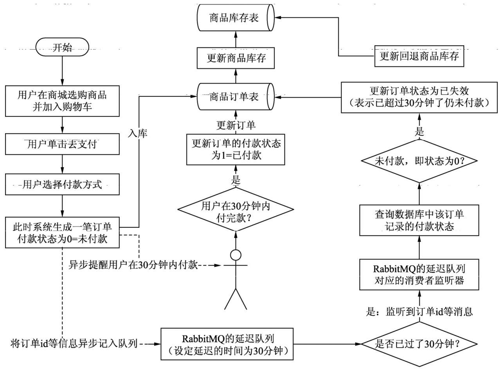
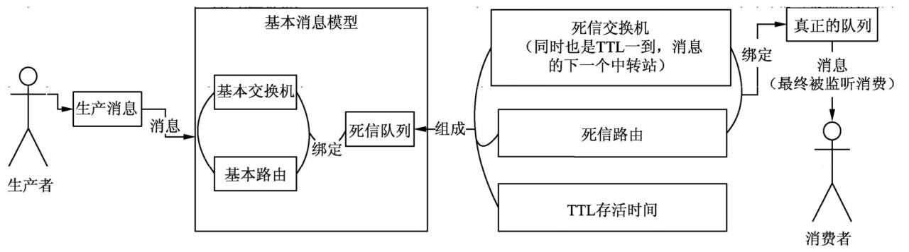

## 第六章 死信队列/延迟队列实战

死信队列/延迟队列：可以等待或延迟一定的时间TTL再处理相应的业务逻辑。

典型应用场景：

死信队列名词理解：DLX(Dead Letter Exchange，必须)、DLK(Dead Letter Routing-key，必须)、TTL(Time To Live，可选);

当消息发生以下情况时，才会出现“死信”的情况：

- 消息被拒绝，并且不再重新投递，requeue参数为false；
- 消息超过了指定的存活时间
- 队列达到了最大长度

处理流程：

